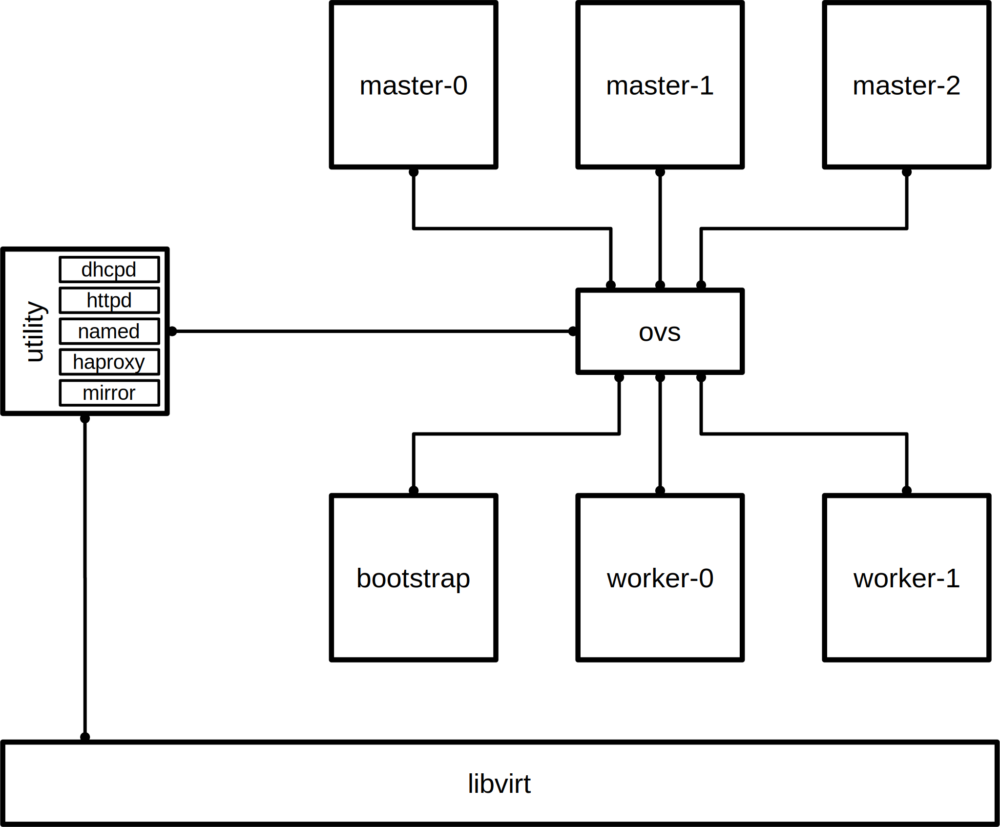

## OpenShift 4 UPI on Libvirt with a Fedora CoreOS utility node




# Prerequisites
```
libvirt
ovs
fcct
```

# Deploy utility node
Create an Open vSwitch bridge
```bash
ovs-vsctl add-br ovsbr
```
Download Fedora CoreOS:
```bash
curl https://builds.coreos.fedoraproject.org/prod/streams/stable/builds/31.20200118.3.0/x86_64/fedora-coreos-31.20200118.3.0-qemu.x86_64.qcow2.xz -o /var/lib/libvirt/images/fedora-coreos-31.20200113.3.1-qemu.x86_64.qcow2
```
Add your SSH key and make any necessary modifications to `utility.fcc`.

Generate ignition config:
```bash
fcct -strict -pretty < fedora.fcc > /var/lib/libvirt/images/utility.ign
```
Start Fedora CoreOS with the ignition config:
```bash
virt-install --connect qemu:///system --import --name utility --network network=default,mac=12:34:56:00:00:68 --network bridge=ovsbr,mac=12:34:56:00:00:75,virtualport_type=openvswitch --ram 1024 --vcpus 1 --os-variant fedora29 --disk size=15,backing_store=/var/lib/libvirt/images/fedora-coreos-31.20200113.3.1-qemu.x86_64.qcow2,format=qcow2,bus=virtio --qemu-commandline="-fw_cfg name=opt/com.coreos/config,file=/var/lib/libvirt/images/utility.ign" --vnc --noautoconsole
```
When the utility node is up, you can start preparing the OpenShift installation.

# Deploy OpenShift nodes
Deploy bootstrap node:
```bash
bash deploy.sh bootstrap
bash start.sh
```
When the bootstrap node is up, deploy the masters:
```bash
bash deploy.sh masters
bash start.sh
```
When the masters are up and the bootstrap process is complete, you are ready to deploy the worker nodes:
```bash
bash deploy.sh workers
bash start.sh
```
Make sure to approve any CSRs that are generated while provisioning workers:
```bash
oc get csr -o go-template --template='{{range .items}}{{if  not .status}}{{printf "%s\n" .metadata.name}}{{end}}{{end}}' | xargs -i oc adm certificate approve {}
```